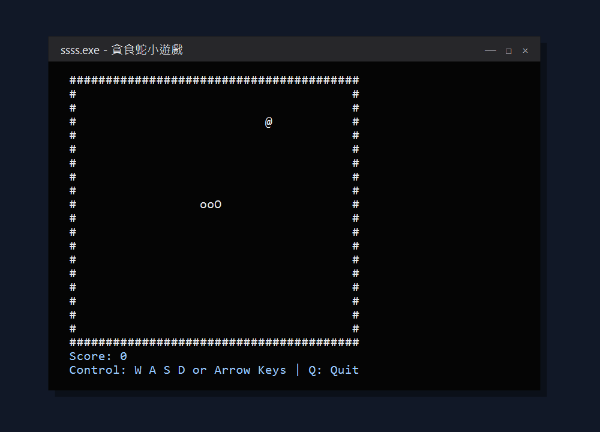
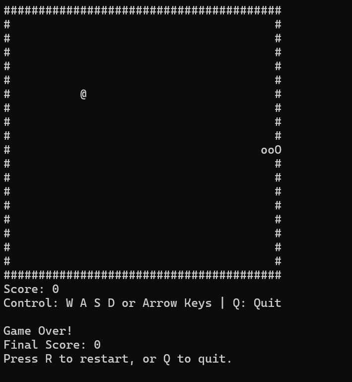
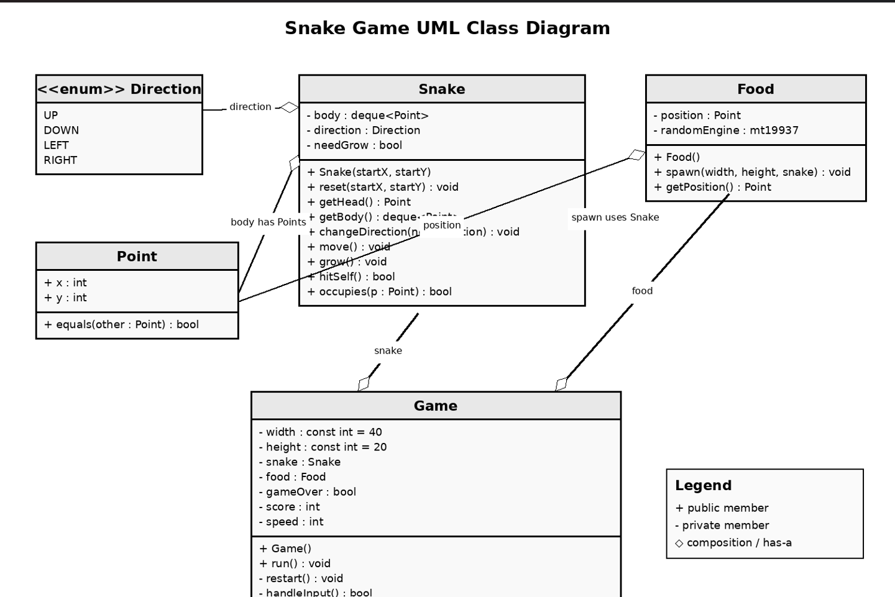

# 貪食蛇小遊戲

## 專題資訊

| 項目 | 內容 |
| --- | --- |
| 組別號碼 | 第 11 組 |
| 系級班級 | 資工 2A |
| 小專題題目 | 貪食蛇小遊戲 |
| 開發語言 | C++ |
| 開發環境 | Visual Studio 2022 |

## 成員資訊

- 胡閔傑
- 鍾文迪
- 萬紫菱

## 遊戲介紹

本專題使用 C++ 製作一款在 Windows 主控台執行的貪食蛇遊戲。玩家需要控制蛇在地圖中移動並吃掉食物，使蛇身逐漸變長並累積分數。隨著分數提高，蛇的移動速度也會加快。

## 遊戲規則

1. 蛇會持續朝目前方向前進。
2. 地圖中的 `@` 代表食物，蛇頭碰到食物即視為吃到食物。
3. 每吃到一個食物可獲得 10 分，蛇身會增加一格。
4. 每累積 50 分，蛇的移動速度會加快。
5. 蛇不能直接轉向目前方向的正反方向。
6. 蛇頭撞到牆壁或自己的身體時，遊戲結束。
7. 遊戲結束後可選擇重新開始或離開遊戲。

## 操作方式

| 按鍵 | 功能 |
| --- | --- |
| `W` 或方向鍵上 | 向上移動 |
| `S` 或方向鍵下 | 向下移動 |
| `A` 或方向鍵左 | 向左移動 |
| `D` 或方向鍵右 | 向右移動 |
| `Q` | 離開遊戲 |
| `R` | 遊戲結束後重新開始 |

畫面符號說明：

- `O`：蛇頭
- `o`：蛇身
- `@`：食物
- `#`：牆壁

## 程式介紹

程式採用物件導向方式設計，主要分成以下類別：

- `Point`：儲存物件的 X、Y 座標，並提供座標比較功能。
- `Snake`：管理蛇身座標、移動方向、轉向、成長及自身碰撞判定。
- `Food`：使用亂數產生食物位置，並避免食物出現在蛇身上。
- `Game`：負責遊戲主迴圈、鍵盤輸入、分數、速度、碰撞判定及畫面繪製。

遊戲地圖大小為 40 × 20。蛇身使用 `deque` 儲存，移動時將新的蛇頭加入前端，再移除尾端；吃到食物時則保留尾端，使蛇身增加一格。畫面會先儲存在 `vector<string>` 中，再輸出到主控台，以減少重複輸出造成的畫面閃爍。


## 安裝與執行

### 系統需求

- Windows 10 或 Windows 11
- Visual Studio 2022
- Visual Studio 的「使用 C++ 的桌面開發」工作負載
- Git（使用下載 ZIP 的方式則不需要）

### 方法一：使用 Git 下載

```powershell
git clone https://github.com/jimmy0579/ssss.git
cd ssss
```

### 方法二：下載 ZIP

1. 在 GitHub 專案頁面點選 `Code`。
2. 選擇 `Download ZIP`。
3. 將下載的 ZIP 檔解壓縮。

### 使用 Visual Studio 執行

1. 開啟專案資料夾中的 `ssss.sln`。
2. 將組態選擇為 `Debug`，平台選擇為 `x64`。
3. 點選「建置」→「建置方案」，或按下 `Ctrl + Shift + B`。
4. 按下 `Ctrl + F5` 執行遊戲。

建置後的執行檔預設位於：

```text
x64\Debug\ssss.exe
```

> 本程式使用 `<conio.h>` 與 `<windows.h>`，目前僅支援 Windows。

## 運行畫面

### 遊戲進行畫面



### 遊戲結束畫面

遊戲結束後會顯示最終分數，玩家可按下 `R` 重新開始，或按下 `Q` 離開遊戲。



## 分工資訊

| 成員 | 分工內容 |
| --- | --- |
| 胡閔傑 | 主題討論、遊戲整體架構、撰寫程式碼、專案整合、功能測試、製作README、製作簡報 |
| 鍾文迪 | 主題討論、功能測試、簡報製作 |
| 萬紫菱 | 主題討論、功能測試 |

## 專案檔案

```text
ssss/
├── docs/
│   ├── game-over.png
│   ├── gameplay.png
│   └── uml-class-diagram.png
├── ssss/
│   ├── main.cpp
│   ├── SnakeGame.cpp
│   ├── SnakeGame.h
│   └── ssss.vcxproj
├── README.md
└── ssss.sln
```
## UML 類別圖


